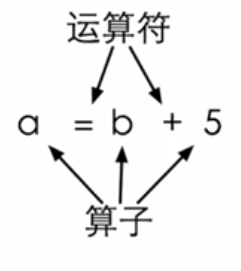

#### 变量 vs 常量
````c
include<stdio.h>
int main(){
	const int NUMBER = 100;//const修饰的变量值不可以被修改
	int amount = 0;
	printf("请输入你的付款金额：");
	scanf("%d",&amount);
	int price = 0;
	printf("请输入购货总金额：");
	scanf("%d",&price);
	int result = 0;
	printf("您本次剩余金额为：%d",amount - price);
	return 0;
}
````

用一个scanf一次读取多个输入：
````c
#include<stdio.h>
int main(){
	int a,b;
	scanf("%d %d",&a,&b);
	printf("%d - %d = %d\n",a,b,a-b);
	return 0;
}
````
>那么终端是怎么等候的，无论是按空格还是回车，只要你没有输入足够的（2个）东西，那么他都会等你。如果你输入的不是数值，那么如果没有初始化的话，就会得到一个很奇怪的东西。

#### 浮点数
中国用的是公制单位，美国用的英制单位，那么5尺7寸是多少？
````C
#include<stdio.h>
int main(){
	printf("请分别输入身高的英尺和英寸，如输入\"5 7\"表示5尺7寸：\n");
	int foot,inch;
	scanf("%d %d",&foot,&inch);
	printf("你的身高换算成公制为：%f",((foot + inch / 12)*0.3048));
	return 0;
}
````
>上面的式子计算的结果有问题哦，5尺7寸正常应该是1.701800米，但是上式的结果是1.524000米。只有英尺进行了计算，英寸没有参与计算一样。
1. 其中，`inch / 12`是两个整数相除，得到的结果也是整数。<spac style="color:red;">两个整数的运算得到的结果也是整数。</span>
2. `10`和`10.0`在C中是完全不同的数
3. `10.0`是浮点数
````C
    printf("%d",10/3);//3
    printf("%d",14/3);//4
    printf("%d",10/3*3);//9
````

````C
#include<stdio.h>
int main(){
    //printf("%d",10.0/3);//会报错，因为%d是int型，double型用%f
    printf("%f",10.0/3);//3.3333333
    printf("%f",10.0/3*3);//10
    return 0;
}
````

修改算身高的：
````C
#include<stdio.h>
int main(){
	printf("请分别输入身高的英尺和英寸，如输入\"5 7\"表示5尺7寸：\n");
	int foot,inch;
	scanf("%d %d",&foot,&inch);
	printf("你的身高换算成公制为：%f",((foot + inch / 12.0)*0.3048));
	return 0;
}
````
>如果运算符号两端有浮点数也有整数，那么C语言在运算之前会将整数转换成浮点数再进行计算。

浮点数有单精度浮点数`float`和双精度浮点数`double`

````C
#include<stdio.h>
int main(){
	printf("请分别输入身高的英尺和英寸，如输入\"5 7\"表示5尺7寸：\n");
	double foot,inch;
	scanf("%lf %lf",&foot,&inch);
	printf("你的身高换算成公制为：%f",((foot + inch / 12)*0.3048));
	return 0;
}
````
>注：输入浮点数用%lf，输出浮点数用%f；输入、输出整数都用%d。

整数的运算效率高于浮点数，所以有整数这个类型。

## 2.3 表达式
表达式是一些`运算符`和`算子`的组合。
运算符（operator）：是指运算的动作，比如加法符（+）、减法符（-）
算子（operand）：参与计算的东西，可以是常数也可以是变量，还可能是一个返回值。

例题：计算时间差
````c
#include<stdio.h>
int main(){
    int hour1,minute1;
    int hour2,minute2;
    scanf("%d %d",&hour1,&minute1);
    scanf("%d %d",&hour2,&minute2);
    int time1 = hour1 * 60 + minute1;
    int time2 = hour2 * 60 + minute2;
    int time = time1-time2;
    int hour = time/60;
    int minute = time%60;
    printf("达到的时间差为：%d小时%d分",hour,minute);
    return 0;
}
````
#### 运算符的优先级
|优先级|运算符|运算|结合关系|举例|
|:-:|:-:|:-:|:-:|:-:|
|1|+|单目不变|自右向左|a*+b|
|1|-|单目取负|自右向左|a*-b|
|2|\*|乘|自左向右|a\*b|
|2|/|除|自左向右|a/b|
|2|%|取余|自左向右|a%b|
|3|+|加|自左向右|a+b|
|3|-|减|自左向右|a-b|
|4|=|赋值|自右向左|a=b|
>5+6，“+”一般就是双目算子，那么什么叫做单目呢？就比如4+4=8，我想让结果等于-8，那么就要在前面加一个负号(-)就行，只有一个算子。单目运算符比乘除优先级高。<span style="color:red;">单目运算符的算子一定在运算符的右面。</span>

>***C语言赋值也是运算符，不是语句。
a=6的结果是a被赋予的值，也就是6；
a=b=6 -> a=(b=6)***

嵌入式赋值（不推荐）：不利于阅读，容易出现错误。
````c
int a = 6;
int b ;
int c = 1 + (b=a);
````

#### 交换两个变量
